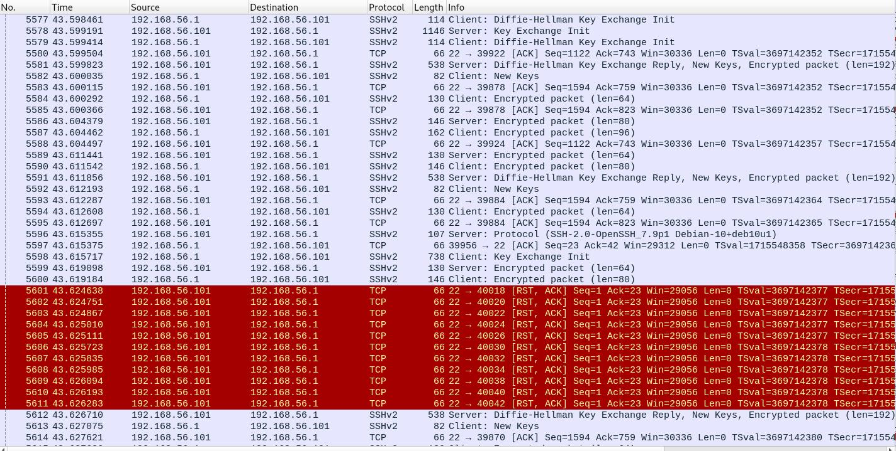

# 🔍 Network Traffic Analysis & Intrusion Detection using Wireshark


> A hands-on SOC lab project to simulate and detect brute-force attacks using real-time network traffic analysis.

---

## 📑 Table of Contents
- [📌 Project Overview](#-project-overview)
- [🎯 Objectives](#-objectives)
- [🛠️ Tools & Technologies](#️-tools--technologies)
- [🧪 Lab Setup](#-lab-setup)
- [⚙️ Steps Performed](#️-steps-performed)
- [🚨 Detection Indicators](#-detection-indicators)
- [📊 Key Findings](#-key-findings)
- [📸 Screenshots](#-screenshots)
- [📁 Project Structure](#-project-structure)
- [💼 Resume Worthy Highlights](#-resume-worthy-highlights)
- [🚀 Future Improvements](#-future-improvements)
- [👤 Author](#-author)

---

## 📌 Project Overview
This project demonstrates a Security Operations Center (SOC) lab where network traffic is captured and analyzed using Wireshark.

A brute-force attack is simulated using Hydra, and the generated traffic is analyzed to detect malicious patterns.

---

## 🎯 Objectives
- Capture and analyze live network traffic  
- Simulate brute-force attack using Hydra  
- Detect suspicious behavior using packet analysis  
- Understand real-world SOC workflow  

---

## 🛠️ Tools & Technologies
- Kali Linux (Attacker Machine)  
- Ubuntu (Target Machine)  
- Wireshark  
- Hydra  
- VirtualBox  

---

## 🧪 Lab Setup
- Attacker: Kali Linux  
- Victim: Ubuntu Machine  
- Network: Same Virtual Network (VirtualBox)

---

## ⚙️ Steps Performed

### 1️⃣ Network Setup
- Configured both VMs in same network  
- Verified connectivity using ping  

### 2️⃣ Packet Capture
- Started Wireshark on Ubuntu  
- Selected active interface  
- Captured live packets  

### 3️⃣ Attack Simulation
```bash
hydra -l username -P password.txt ssh://<target-ip>
```

### 4️⃣ Traffic Analysis
```
tcp.port == 22
```
- Observed repeated login attempts
- Identified abnormal traffic spikes

### 5️⃣ Detection
- Multiple failed SSH login attempts
- Same IP sending repeated requests
- High-frequency traffic on port 22

---

## 🚨 Detection Indicators
- Repeated authentication failures
- Continuous connection attempts
- Abnormal spike in SSH traffic
- Suspicious source IP behavior

---

## 📊 Key Findings
- Brute-force attacks generate high-volume traffic
- Easily detectable using filters in Wireshark
- Packet-level analysis helps identify attack patterns

---

## 📸 Screenshots
- Wireshark Packet Capture


- Hydra Brute-force Attack

- Traffic Analysis


---

## 📁 Project Structure
```
Network-Traffic-Analysis-Intrusion-Detection-using-Wireshark/
│
├── screenshots/
├── capture-files/
├── README.md
└── notes.txt
```

---

## 💼 Resume Worthy Highlights
- Simulated brute-force attack using Hydra
- Performed network traffic analysis using Wireshark
- Identified attack patterns through packet inspection
- Built a mini SOC lab environment

---

## 🚀 Future Improvements
- Integrate with SIEM tools (Splunk)
- Add Suricata IDS detection
- Automate alert system
- Analyze additional attack scenarios

---

## 👤 Author
Umang Srivastava

Cybersecurity Enthusiast | Aspiring Penetration Tester

---

### ⭐ Support

### If you like this project, give it a star ⭐ on GitHub!
